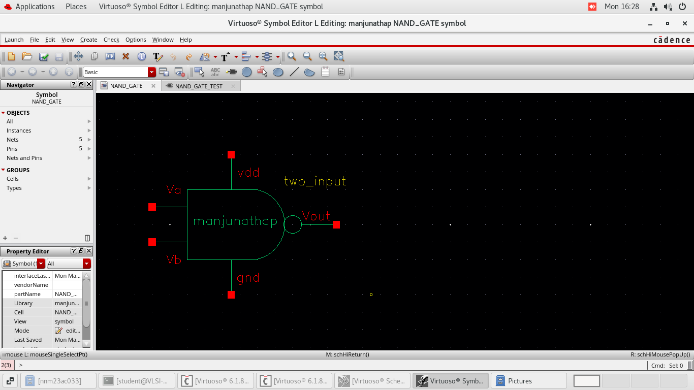

# Module 04 – Generating Symbols

## Lab 4-1 – Generating Symbol for NAND2

### Objective
To create a reusable symbol from the NAND schematic.

---

## Activities Performed

- Used Create → Cellview → From Cellview
- Generated symbol automatically from schematic
- Verified pin placement (A, B, VDD, GND, Output)
- Adjusted symbol graphics if required

---

## Importance of Symbol Creation

- Enables hierarchical design
- Allows NAND gate reuse in larger circuits
- Simplifies top-level testbench construction

---

## Learning Outcome

Symbol generation is essential for modular and scalable IC design.
